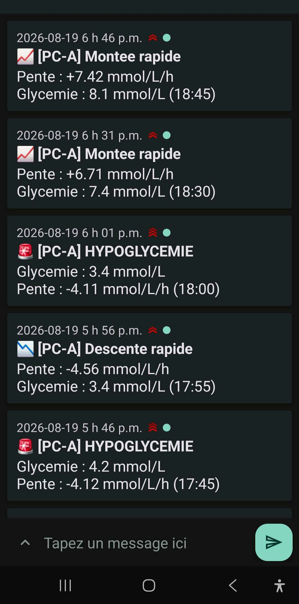
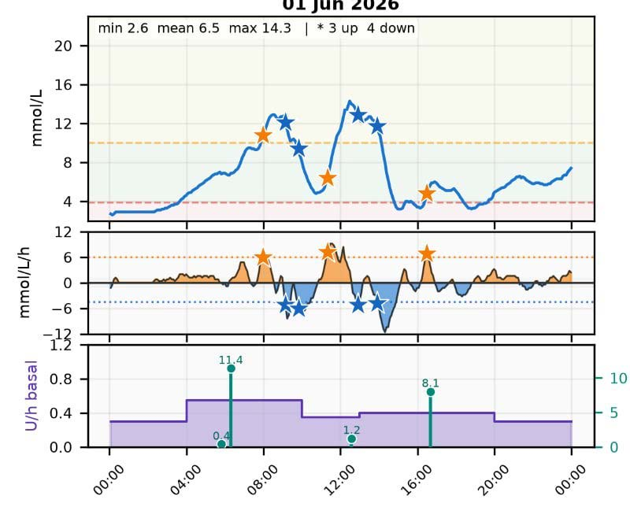
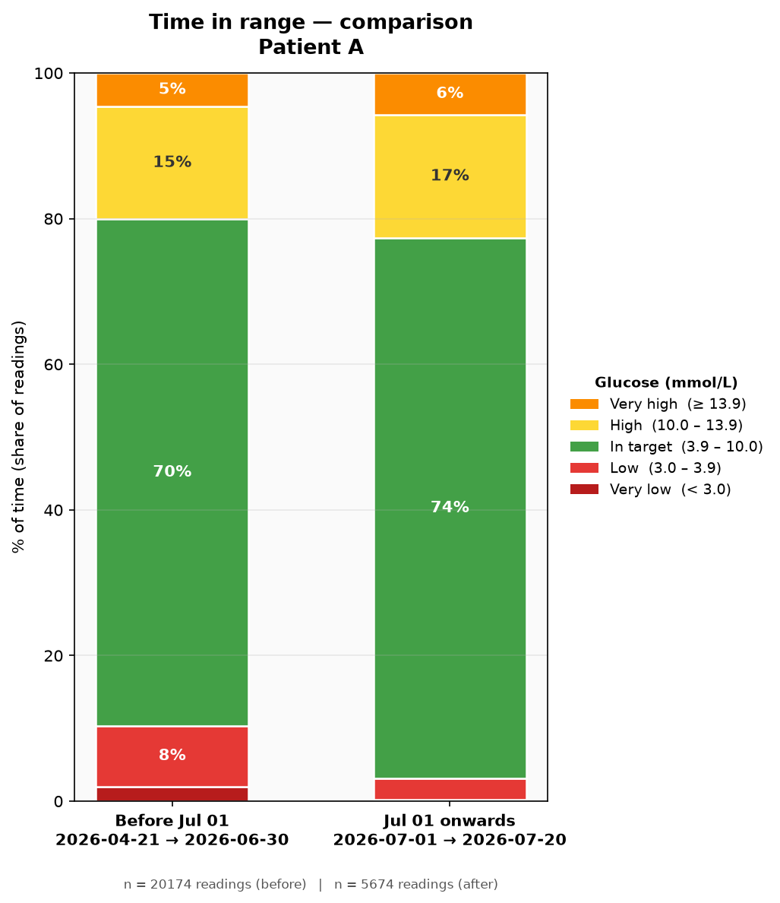
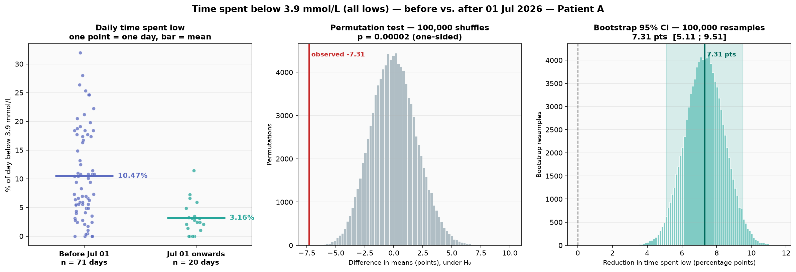
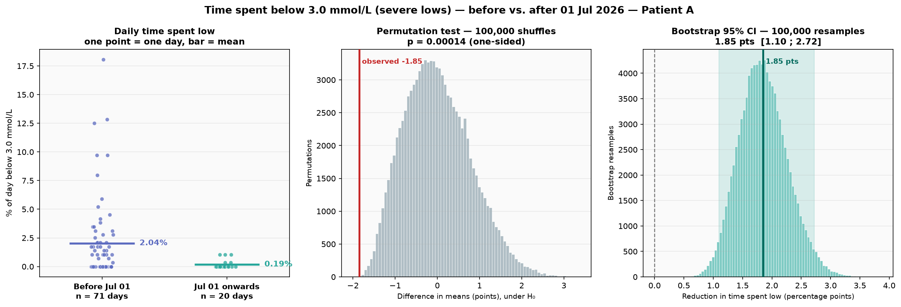

# Rate-of-change alerting for FreeStyle Libre 3

A monitoring script that polls a FreeStyle Libre 3 sensor through the
LibreLinkUp cloud service, computes the **rate of change of glucose** on a
continuous scale, and pushes a phone notification when that rate crosses a
threshold chosen for one specific patient — together with the analysis code
used to check whether the alerts were followed by a measurable change.

This is a personal project built around one person's data. It is **not a
medical device**; see [Limitations and warnings](#limitations-and-warnings).

---

## 1. What the application does

`Diab_v2.py` runs continuously on a machine at home. Every 5 minutes it:

1. reads the latest glucose value from the **LibreLinkUp** API (the follower
   service that mirrors a Libre 3 sensor to a caregiver's phone);
2. recomputes the slope of the last 40 minutes of readings;
3. decides whether anything is worth waking someone up for;
4. pushes a notification to a phone via **ntfy**;
5. pings a **healthchecks.io** URL to prove it is still alive.

It alerts on two independent families of condition:

| Condition | Parameter | Value in use |
|---|---|---|
| Glucose below a level | `HYPO_SEUIL` | 5.0 mmol/L |
| Glucose above a level | `HYPER_SEUIL` | 14.0 mmol/L |
| Falling faster than | `SEUIL_BAS` | −4.5 mmol/L/h |
| Rising faster than | `SEUIL_HAUT` | +6.0 mmol/L/h |

A repeat of the same alert type is suppressed for 15 minutes
(`SILENCE_ALERTE`), so a long excursion produces one notification rather than
a stream of them.

### How the slope is computed

The slope is a **causal weighted least-squares regression** over the last
8 readings (40 minutes), with exponentially decaying weights (`decay = 0.7`)
that favour the most recent points:

```python
def pente_wls(glucose_series, window=8, decay=0.7):
    """Causal weighted linear regression — no future point is ever used."""
```

The estimator is **causal**: only past readings enter the fit, so the value
shown in real time is the same value a retrospective review would produce —
nothing is smoothed using information from the future.

The rest is a deliberate trade of speed for **robustness**. A slope taken from
two consecutive readings is dominated by sensor noise: interstitial glucose is
a noisy signal, and a single erratic point can swing a two-point difference by
several mmol/L/h. Fitting a line across eight readings spreads that noise over
the whole window, so no single point can move the estimate much — that is what
robustness buys. The exponential decay keeps the fit anchored on recent data
rather than weighting a 40-minute-old reading as heavily as the last one.

**The cost is latency, and it is real.** This slope reacts more slowly than the
Libre trend arrow or a Dexcom rate alert, both of which work from a shorter
window. On a genuinely sharp fall, this application fires a few minutes later
than they would. That is not a side effect to be explained away; it is the
price of the estimator.

The patient chose the slower estimator anyway, for a reason about the **end** of
an episode rather than its start. During steep falls, the arrow in the existing
apps often flipped to *stable* while glucose was still dropping clearly — a
false all-clear, which invites you to stop watching mid-event. The 40-minute fit
stays negative until the fall genuinely flattens, so it can be trusted to say
when an episode is over. Starting late was accepted to gain that. That
is a preference, not a finding: a patient with different hypoglycaemia
awareness could reasonably choose the opposite, and `WLS_WINDOW` and
`WLS_DECAY` are exposed as parameters precisely because this is a judgement
call, not a constant of nature.

---

## 2. Why the Libre 3 app does not cover this need

The Libre 3 app has low- and high-glucose alarms and a signal-loss alarm. It
does **not** have a rate-of-change alarm. Trend information is delivered only
as a **trend arrow**, and only when the patient opens the app.

Three gaps follow from that.

**An arrow is a bucket, not a measurement.** The five arrow states collapse a
continuous quantity into five categories. On Abbott's published thresholds,
the "falling quickly" arrow appears at roughly −6 mmol/L/h; everything between
−3.6 and −6 mmol/L/h shares a single arrow, and everything below −6 shares
another. This patient's clinically relevant threshold is **−4.5 mmol/L/h** —
inside a bucket, invisible as a change of arrow. The application displays the
number itself (`Pente : -4.11 mmol/L/h`), so the same event is legible whether
it is −4.1 or −9.

**An arrow is not an alert.** Nothing pushes it. A fall that begins during
sleep produces no notification until a level threshold is crossed, by which
point the fall is already an event rather than a warning.

**The thresholds are not the patient's.** The arrow cut-offs are fixed by the
manufacturer and identical for every user. The values in this project were set
by discussing with the patient which episodes actually mattered to them, then
tuning the two thresholds until the alerts matched those episodes — few enough
to stay meaningful, early enough to be useful. The figure in
[section 5](#5-does-it-work) shows what that tuning looks like on a single day.

---

## 3. Comparison with Dexcom rate alerts

Dexcom is the reference point here, because Dexcom's receivers *do* offer
rate-of-change alerts, and the comparison is informative rather than
flattering to either side.

| | Libre 3 app | Dexcom G6 / G7 | This project |
|---|---|---|---|
| Rate alert exists | no | yes (Rise Rate / Fall Rate) | yes |
| Fall thresholds | — | 2 or 3 mg/dL/min | any value |
| in mmol/L/h | — | **6.7** or **10.0** | **4.5** in use |
| Slope estimator | undisclosed | undisclosed | causal WLS, 40 min, published above |
| Rate value shown | arrow only | arrow only | numeric mmol/L/h |
| Runs on | Libre hardware | Dexcom hardware | Libre hardware |

The relevant difference is not that Dexcom lacks the feature — it has it — but
that **its two fixed options are both less sensitive than what this patient
needs**. A −4.5 mmol/L/h fall does not trigger a Dexcom Fall Rate alert at
either setting, because the gentler of the two only fires at −6.7 mmol/L/h.
Switching hardware would not have solved the problem; it would have moved it.

Dexcom also offers *Urgent Low Soon*, a predictive alert that fires when a
severe low is projected within 20 minutes. That is a different design: it
predicts a **level**, while this project alerts on a **rate**. The two are
complementary, and a rate alert fires earlier in a fast fall that starts from
a high value.

> Product specifications change. The Dexcom and Abbott figures above reflect
> published documentation at the time of writing and should be re-checked
> before being relied on.

---

## 4. Alerts, data sources, and reliability

### What an alert looks like



Each notification carries the machine name, the event type, the numeric slope
and the glucose value with its timestamp. Priority is mapped to severity, so
a hypoglycaemia alert can break through a silenced phone while a routine
"rapid rise" does not.

### Data sources

| Source | Content | Used by |
|---|---|---|
| LibreLinkUp API | live glucose, polled every 5 min | `Diab_v2.py` |
| LibreView CSV export | historical glucose, 5-min resolution | all analysis scripts |
| Insulin pump CSV export | bolus doses and basal rates | `glucose_slope_insulin.py` |

The pump export arrives as a `.zip`; `glucose_slope_insulin.py` reads the CSVs
directly from inside the archive, so no unpacking step is needed.

### Combining the three streams for the care team

Glucose, basal insulin and bolus insulin live in three separate exports, from
two different vendors, with different timestamp formats and a comma decimal
separator. Reviewing them means opening three files side by side and aligning
them mentally.

`analysis/glucose_slope_insulin.py` merges them onto a **single shared time
axis**, one panel stack per day: glucose on top, rate of change in the middle,
insulin at the bottom. A dose and the glucose response that follows it sit on
the same vertical line, which is the form a clinician can actually read in a
short appointment.

When the pump export does not reach a given day, the insulin panel says
`no insulin data` rather than being left blank — an empty panel is
indistinguishable from "no insulin was delivered", which would be the opposite
of the truth.

### Staying alive

Two mechanisms, because a monitor that dies silently is worse than no monitor:

- **ntfy** — the phone-side transport. The topic name is the only secret
  protecting it, so it is supplied from an untracked `.env` file.
- **healthchecks.io** — a dead-man's switch. The script pings a URL on every
  successful cycle. If the pings stop — crash, power cut, network outage —
  healthchecks.io raises the alarm. It watches the watcher. The watchdog is
  optional and switches itself off if no UUID is configured.

---

## 5. Does it work?

### Choosing the thresholds



One day, three aligned panels. The middle panel shows the rate of change with
the two thresholds drawn as dotted lines; stars mark the first reading of each
episode that crosses one. This is the view used to calibrate `SEUIL_BAS` and
`SEUIL_HAUT`: thresholds too tight produce a star on every fluctuation,
thresholds too loose miss the falls that matter to the patient.

### Time in range, before and after



| | before 1 Jul | from 1 Jul |
|---|---|---|
| Very low (< 3.0) | 2.0 % | 0.2 % |
| Low (3.0–3.9) | 8.3 % | 2.9 % |
| **In target (3.9–10.0)** | **69.5 %** | **74.2 %** |
| High (10.0–13.9) | 15.5 % | 16.9 % |
| Very high (≥ 13.9) | 4.6 % | 5.7 % |

### Time spent low: hypothesis test





| Threshold | Before | After | Absolute change | 95 % CI | p (one-sided) |
|---|---|---|---|---|---|
| < 3.9 mmol/L | 10.47 % | 3.16 % | −7.31 pts | [5.11 ; 9.51] | 0.00002 |
| < 3.0 mmol/L | 2.04 % | 0.19 % | −1.85 pts | [1.10 ; 2.72] | 0.00014 |

Median daily time below 3.0 mmol/L in the second period is **0.00 %**: more
than half of those days contain no severe low at all.

### How the test was done

**The unit of analysis is the day, not the reading.** Readings 5 minutes apart
are strongly autocorrelated. Treating 25 848 readings as 25 848 independent
observations would be pseudoreplication and would produce a p-value that is
essentially meaningless. Each day is reduced to one number — the percentage of
recorded time spent below the threshold — giving 71 days before the cutoff and
20 after.

**Time-weighted, not count-weighted.** Each reading is credited with the time
until the next one, capped at 20 minutes so that a sensor outage is not
counted as hours spent at its last known value.

**Permutation test, 100 000 shuffles.** The day labels are shuffled at random
and the difference in means recomputed each time, building the distribution of
differences expected if the cutoff date meant nothing. This assumes no
distribution shape — which matters, because daily time-below is strongly
right-skewed. The observed difference is compared against that null.

**Bootstrap confidence interval, 100 000 resamples.** Whole days are resampled
with replacement within each period, giving the 95 % interval on the size of
the change.


### What these numbers do and do not establish

The association is large and the tests are unambiguous about it.

However, this is a **single-subject, observational, before-and-after comparison**.
There is no control group, no randomisation, and no blinding. The alerting
system was introduced around the cutoff date, but it was not the only thing
that changed in that person's life, and nothing in this design separates its
effect from anything else that changed at the same time: for example, simply the
attention that comes with being measured.

The periods are also unequal and short: 71 days against 20. A 20-day window is
sensitive to a single unusual fortnight.

The honest statement is: **time spent low fell substantially and the fall is
far too large to be chance.** Attributing that fall to the alerts specifically
is a hypothesis this data is consistent with, not a conclusion it supports.

---

## 6. Limitations and warnings

**This is not a medical device.** It is not certified, validated, or tested to
any standard. It has no redundancy: if the machine sleeps, the network drops,
or the LibreLinkUp API changes, alerts stop. The healthchecks watchdog reduces
the chance of that going unnoticed; it does not prevent it.

**Do not make treatment decisions from these numbers.** No insulin dose,
correction, or carbohydrate intake should be based on a slope value produced
by this script. The slope is an estimate from a noisy interstitial signal with
its own lag; it is a prompt to look, not a measurement to act on. Confirm with
a fingerstick where the decision matters, and follow the care team.

---

## 7. Repository layout

```
├── Diab_v2.py          the live monitor (LibreLinkUp → slope → ntfy)
├── analysis/
│   ├── glucose_slope_insulin.py   glucose + slope + insulin, aligned per day
│   ├── time_in_range.py           time-in-range comparison
│   └── time_in_hypo_stats.py      permutation test + bootstrap CI
├── data/                          exports (git-ignored, never committed)
├── figures/                       the figures used in this README
├── .env.example                   template for the secrets
└── requirements.txt
```

### Running it

```bash
python -m venv .venv && source .venv/bin/activate
pip install -r requirements.txt

cp .env.example .env     # then fill in your own credentials
python Diab_v2.py        # live monitor

python analysis/time_in_hypo_stats.py   # analyses; figures land in figures/
```

Analysis scripts read from `data/` and resolve every path from their own
location, so they run from any working directory.

